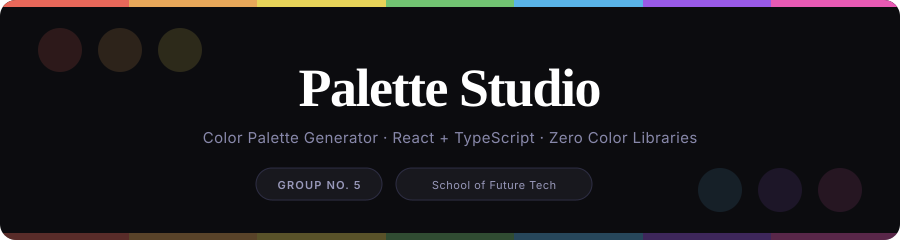

<div align="center">
  
  <svg width="900" height="240" viewBox="0 0 900 240" xmlns="http://www.w3.org/2000/svg">
  <defs>
    <clipPath id="c"><rect width="900" height="240" rx="16"/></clipPath>
  </defs>

  <!-- Background -->
  <rect width="900" height="240" rx="16" fill="#0c0c0f"/>

  <!-- Top rainbow bar -->
  <rect x="0"   y="0" width="129" height="7" rx="0" fill="#e8685a" clip-path="url(#c)"/>
  <rect x="129" y="0" width="128" height="7" fill="#e8a85a" clip-path="url(#c)"/>
  <rect x="257" y="0" width="129" height="7" fill="#e8d45a" clip-path="url(#c)"/>
  <rect x="386" y="0" width="128" height="7" fill="#72c472" clip-path="url(#c)"/>
  <rect x="514" y="0" width="129" height="7" fill="#5ab4e8" clip-path="url(#c)"/>
  <rect x="643" y="0" width="128" height="7" fill="#9a5ae8" clip-path="url(#c)"/>
  <rect x="771" y="0" width="129" height="7" fill="#e85ab4" clip-path="url(#c)"/>

  <!-- Color dot row — decorative -->
  <circle cx="60"  cy="50" r="22" fill="#e8685a" opacity="0.15"/>
  <circle cx="120" cy="50" r="22" fill="#e8a85a" opacity="0.15"/>
  <circle cx="180" cy="50" r="22" fill="#e8d45a" opacity="0.15"/>
  <circle cx="720" cy="190" r="22" fill="#5ab4e8" opacity="0.12"/>
  <circle cx="780" cy="190" r="22" fill="#9a5ae8" opacity="0.12"/>
  <circle cx="840" cy="190" r="22" fill="#e85ab4" opacity="0.12"/>

  <!-- Title -->
  <text x="450" y="106" text-anchor="middle"
        font-family="Georgia, 'Times New Roman', serif"
        font-size="54" font-weight="700"
        fill="#ffffff" letter-spacing="-1.5">Palette Studio</text>

  <!-- Tagline -->
  <text x="450" y="143" text-anchor="middle"
        font-family="-apple-system, BlinkMacSystemFont, 'Segoe UI', sans-serif"
        font-size="15" font-weight="400"
        fill="#8888aa" letter-spacing="0.4">
    Color Palette Generator · React + TypeScript · Zero Color Libraries
  </text>

  <!-- Group pill -->
  <rect x="256" y="168" width="126" height="32" rx="16" fill="#18181e" stroke="#2e2e44" stroke-width="1"/>
  <text x="319" y="189" text-anchor="middle"
        font-family="-apple-system, BlinkMacSystemFont, 'Segoe UI', sans-serif"
        font-size="11" font-weight="600"
        fill="#9999bb" letter-spacing="1.2">GROUP NO. 5</text>

  <!-- School pill -->
  <rect x="396" y="168" width="196" height="32" rx="16" fill="#18181e" stroke="#2e2e44" stroke-width="1"/>
  <text x="494" y="189" text-anchor="middle"
        font-family="-apple-system, BlinkMacSystemFont, 'Segoe UI', sans-serif"
        font-size="11" font-weight="400"
        fill="#9999bb" letter-spacing="0.5">School of Future Tech</text>

  <!-- Bottom rainbow bar (faded) -->
  <rect x="0"   y="233" width="129" height="7" fill="#e8685a" opacity="0.35" clip-path="url(#c)"/>
  <rect x="129" y="233" width="128" height="7" fill="#e8a85a" opacity="0.35" clip-path="url(#c)"/>
  <rect x="257" y="233" width="129" height="7" fill="#e8d45a" opacity="0.35" clip-path="url(#c)"/>
  <rect x="386" y="233" width="128" height="7" fill="#72c472" opacity="0.35" clip-path="url(#c)"/>
  <rect x="514" y="233" width="129" height="7" fill="#5ab4e8" opacity="0.35" clip-path="url(#c)"/>
  <rect x="643" y="233" width="128" height="7" fill="#9a5ae8" opacity="0.35" clip-path="url(#c)"/>
  <rect x="771" y="233" width="129" height="7" fill="#e85ab4" opacity="0.35" clip-path="url(#c)"/>
</svg>
  <br/><br/>

[](https://react-mini-project-flame-seven.vercel.app/)
[](https://react.dev/)
[](https://www.typescriptlang.org/)
[](https://tailwindcss.com/)
[](https://vercel.com/)

</div>

---

## What is this?

Palette Studio is a browser-based **color palette generator** built entirely with React and TypeScript. The assignment was to generate a random hex code and copy it to clipboard — we built a complete color science tool on top of that.

Every color calculation — conversions, contrast ratios, harmony generation, colorblindness simulation — is written in **pure TypeScript math** with zero external color libraries.

---

## Features

| | Feature | What it does |
|---|---|---|
| 🎲 | **Random Generation** | Generates colors in HSL space (not RGB) — every result is vivid, never muddy |
| 📋 | **Clipboard Copy** | Click any hex code to copy via `navigator.clipboard` |
| 🎨 | **Harmonic Palettes** | Derives 4 colors per generate using real color theory (complementary, analogous, triadic, split) |
| 🔬 | **Color Conversions** | Full HEX ↔ RGB ↔ HSL in both directions, shown live |
| 🎭 | **Mood Labels** | Classifies every color into one of 12 named moods (Vermillion, Cobalt, Amethyst…) |
| ♿ | **WCAG Contrast** | Checks accessibility compliance — AA and AAA badges against black and white text |
| 👁️ | **Colorblindness Sim** | Simulates Protanopia, Deuteranopia, and Tritanopia using matrix transforms |
| 📤 | **Export** | One-click export to CSS, SCSS, JSON, Tailwind config, SwiftUI, Jetpack Compose |
| 🗂️ | **Explore** | Browse 80+ curated colors, filterable by mood and saturation style |
| 🔖 | **Saved Collection** | Bookmark colors — persisted across sessions with `localStorage` (up to 24) |
| ⌨️ | **Keyboard Shortcut** | Press `Space` or `Ctrl/Cmd + G` to generate anywhere on the page |

---

## How it works

### Why HSL instead of random RGB?

Fully random RGB produces lots of near-black, near-white, and muddy brown colors. Instead, we randomize in **HSL space** with constraints:

```ts
const h = Math.floor(Math.random() * 360)     // full color wheel
const s = Math.floor(Math.random() * 65) + 30 // 30–95%  — no washed-out grays
const l = Math.floor(Math.random() * 50) + 22 // 22–72%  — no black or white
```

Every color that comes out is guaranteed to be vivid and usable.

---

### Color space conversions — pure math, no library

Three bidirectional functions handle all conversions:

**HEX → RGB** — strip `#`, split into 3 pairs of hex digits, parse each with `parseInt(str, 16)`:
```
"#B5673C"  →  { r: 181, g: 103, b: 60 }
```

**RGB → HSL** — normalize to [0,1], find max/min channels, then compute lightness, saturation, and hue based on which channel is dominant.

**HSL → HEX** — uses the CSS Color Module Level 4 piecewise (k-value) formula to reverse the process.

---

### Harmonic palette generation — color theory applied

Given a base color, four harmonic colors are derived by rotating the hue wheel:

| Harmony | Hue offset | Effect |
|---|---|---|
| Complementary | +180° | Maximum contrast |
| Analogous | +30° | Cohesive, calm |
| Triadic | +120° | Vibrant, balanced |
| Split-Complementary | +210° | Nuanced contrast |

Saturation and lightness are also nudged per harmony to avoid mechanical-looking results.

---

### WCAG accessibility contrast

Every generated color is scored against both white and black text using the **W3C relative luminance formula**:

```
L = 0.2126 × R_linear + 0.7152 × G_linear + 0.0722 × B_linear
Contrast = (L_lighter + 0.05) / (L_darker + 0.05)
```

The coefficients reflect human eye sensitivity — we see green most, blue least. sRGB gamma correction is applied before the formula. Results are rated:

- **AA** → ratio ≥ 4.5 : 1 (standard readable text)
- **AAA** → ratio ≥ 7.0 : 1 (enhanced accessibility)

---

### Colorblindness simulation

Based on the Brettel, Viénot & Mollon (1997) RGB transformation matrices. The channels are remapped to approximate what each affected person would see:

- **Protanopia** — reduced red cone sensitivity (~1.3% of males)
- **Deuteranopia** — reduced green cone sensitivity (~1.2% of males)
- **Tritanopia** — reduced blue cone sensitivity (~0.01% of population)

---

### State management

All color state lives in a single `ColorContext` — no Redux, just React's built-in Context API with `useState` and `useCallback`. It manages the current color, 12-item history, saved collection, toast notifications, and clipboard state. Saved colors are written to `localStorage` and reloaded on every visit.

---

## Stack

`React 18` · `TypeScript 5.5` · `Vite 5` · `Tailwind CSS 3` · `Framer Motion` · `React Router v6`

---

<div align="center">

**DSA Mini Project — Case Study 5 · School of Future Tech · Group No. 5**

[🚀 Live Demo](https://react-mini-project-flame-seven.vercel.app/) · Sahil Kumar · Mukesh Choudhary · Shivam Sah

</div>
